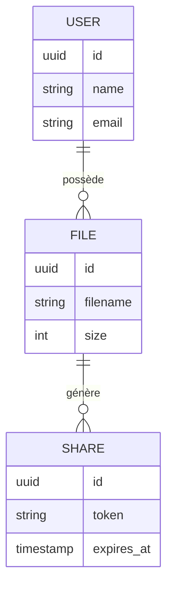

# 📄 Modèle de Données (MCD)

## 🧠 Objectif
Le modèle de données a été conçu pour structurer les piliers fondamentaux de l'application :
* **Gestion des utilisateurs** : Authentification et profils.
* **Stockage des fichiers** : Métadonnées et traçabilité des uploads.
* **Partage sécurisé** : Génération de liens d'accès contrôlés.

---

## 📊 Entités

### 👤 Utilisateur (`User`)
Représente les comptes enregistrés sur la plateforme.

| Champ | Type | Description |
| :--- | :--- | :--- |
| `id` | **UUID / INT** | Identifiant unique (Clé Primaire) |
| `name` | **string** | Nom complet de l’utilisateur |
| `email` | **string** | Adresse email unique |
| `password` | **string** | Mot de passe (hashé via Argon2 ou Bcrypt) |
| `created_at`| **timestamp** | Date d’inscription |

### 📁 Fichier (`File`)
Représente les documents physiques stockés sur le serveur ou le cloud.

| Champ | Type | Description |
| :--- | :--- | :--- |
| `id` | **UUID / INT** | Identifiant unique (Clé Primaire) |
| `user_id` | **FK** | Référence à l’utilisateur propriétaire |
| `filename` | **string** | Nom technique sur le stockage (ex: `uuid.ext`) |
| `original_name`| **string** | Nom d'origine du fichier (ex: `rapport.pdf`) |
| `path` | **string** | Chemin relatif ou URL de stockage |
| `size` | **integer** | Taille en octets |
| `mime_type` | **string** | Type de contenu (ex: `application/pdf`) |
| `created_at` | **timestamp** | Horodatage de l'upload |

### 🔗 Partage (`Share`)
Gère les liens d'accès publics ou privés générés pour un fichier.

| Champ | Type | Description |
| :--- | :--- | :--- |
| `id` | **UUID / INT** | Identifiant unique (Clé Primaire) |
| `file_id` | **FK** | Référence au fichier partagé |
| `token` | **string** | Clé d'accès unique et sécurisée (Slug) |
| `expires_at` | **timestamp** | Date d’expiration (optionnelle) |
| `created_at` | **timestamp** | Date de génération du lien |

---

## 🔗 Relations & Cardinalités

Le schéma repose sur une hiérarchie simple et efficace :

* **User 1:N File** : Un utilisateur peut posséder plusieurs fichiers, mais un fichier appartient à un seul propriétaire.
* **File 1:N Share** : Un fichier peut faire l'objet de plusieurs partages (ex: un lien public, un lien avec expiration différente).

---

## 🧩 Schéma relationnel simplifié

---

## 🔒 Choix de conception

1.  **Sécurité par Token** : L'accès aux fichiers ne se fait pas via l'ID de la base de données, mais via un `token` unique et imprédictible pour éviter le "ID enumeration".
2.  **Flexibilité du stockage** : La séparation entre `original_name` et `filename` permet d'éviter les conflits de noms sur le disque et les attaques par injection de fichiers.
3.  **Contrôle temporel** : Le champ `expires_at` permet d'implémenter facilement une logique de liens éphémères, renforçant la confidentialité des données.