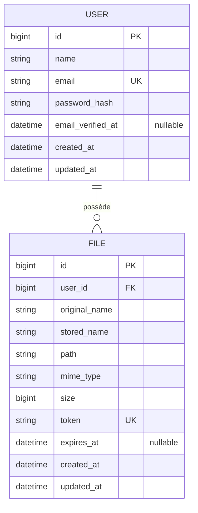

# Modèle de données — Datashare

Vue **logique** (type MCD) et **physique** (tables Laravel). La base cible est relationnelle (SQLite en dev, MySQL/PostgreSQL en production selon `.env`).

## MCD (vue conceptuelle)

### Entités

| Entité | Description |
| --- | --- |
| **USER** | Compte applicatif : identité pour l’auth Sanctum et propriété des fichiers. |
| **FILE** | Métadonnées d’un dépôt + jeton opaque pour le téléchargement anonyme par URL. |

### Relations

- **USER → FILE** : relation **1,N** (un utilisateur possède plusieurs fichiers ; un fichier appartient à exactement un utilisateur).
- Suppression utilisateur : **cascade** sur les fichiers (`onDelete('cascade')` sur la clé étrangère).

### Règles métier reflétées en base

- Le **téléchargement public** ne passe pas par `user_id` : il utilise `FILE.token` (unique).
- **`expires_at`** contrôle la validité du lien ; `null` peut être accepté côté schéma mais le flux métier fixe une date à l’upload (J+7) et permet la mise à jour via l’API.

---

## Modèle physique (tables)

### `users`

| Colonne | Type | Contraintes |
| --- | --- | --- |
| `id` | bigint unsigned | PK, auto |
| `name` | varchar | |
| `email` | varchar | unique |
| `email_verified_at` | timestamp | nullable |
| `password` | varchar | hash stocké |
| `remember_token` | varchar | nullable |
| `created_at`, `updated_at` | timestamp | |

Tables Laravel associées dans la même migration initiale : `password_reset_tokens`, `sessions` (mécanismes framework).

### `personal_access_tokens` (Laravel Sanctum)

Stocke les jetons API (`tokenable_type`, `tokenable_id`, `name`, `token`, `abilities`, `expires_at`, …). Utilisée pour émettre le Bearer renvoyé au login.

### `files`

| Colonne | Type | Contraintes |
| --- | --- | --- |
| `id` | bigint unsigned | PK |
| `user_id` | bigint unsigned | FK → `users.id`, cascade delete |
| `original_name` | varchar | nom affiché / téléchargement |
| `stored_name` | varchar | nom interne sur disque |
| `path` | varchar | chemin logique stockage (`uploads/…`) |
| `mime_type` | varchar | |
| `size` | bigint unsigned | octets |
| `token` | varchar | unique — identifiant public du lien |
| `expires_at` | timestamp | nullable |
| `created_at`, `updated_at` | timestamp | |

### Stockage fichiers

Les octets du fichier sont stockés via le **filesystem** Laravel (`storage/app/…`), pas dans la base. La colonne `path` relie la ligne `files` au fichier sur disque.

---

## Indices et performances

- Index implicites sur clés primaires et **unique** (`users.email`, `files.token`).
- Liste paginée des fichiers : filtre `search` sur `original_name`, tri sur colonnes whitelistées en contrôleur (`created_at`, `original_name`, `size`).

---

## Évolution possible (hors MVP)

- Table **SHARE** ou **AUDIT** si l’on veut plusieurs liens par fichier ou traçabilité des téléchargements.
- Quotas par utilisateur (`max_storage` sur `users` ou agrégation sur `files.size`).
