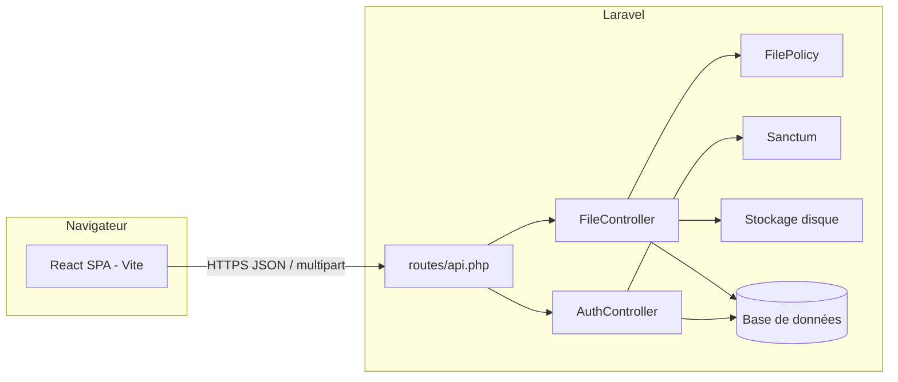

# Datashare

Plateforme de dépôt et de partage de fichiers : SPA React qui dialogue avec une API Laravel (Sanctum), stockage des fichiers sur disque et téléchargement via lien à jeton avec expiration.

## Présentation

- **Utilisateurs** : inscription, connexion par token Bearer.
- **Fichiers** : upload (multipart), liste paginée avec recherche et tri, détail, mise à jour des métadonnées (nom, date d’expiration), suppression.
- **Partage** : chaque fichier possède un jeton unique ; l’URL publique `/api/files/download/{token}` permet le téléchargement tant que le lien n’est pas expiré.

## Stack

| Couche | Technologies |
| --- | --- |
| Frontend | React 19, Vite 8, React Router 7, Axios, Tailwind CSS 4 |
| Backend | PHP 8.3+, Laravel 13, Laravel Sanctum 4 |
| Base de données | SQLite (défaut Laravel) ou MySQL / PostgreSQL via `.env` |
| Tests | PHPUnit 12, ESLint (frontend) |

## Installation

### Prérequis

- PHP 8.3+, Composer, Node.js 20+ (recommandé), npm.

### Backend (`datashare-backend`)

```bash
cd datashare-backend
composer install
cp .env.example .env   # si le fichier est présent après clone
php artisan key:generate
```

Configurer la base dans `.env` (voir [Variables d’environnement](#variables-denvironnement)), puis :

```bash
php artisan migrate
php artisan db:seed   # optionnel — crée notamment un utilisateur de démo
```

### Frontend (`datashare-frontend`)

```bash
cd datashare-frontend
npm install
```

Adaptez l’URL de l’API dans `datashare-frontend/src/services/api.js` (`baseURL`) pour qu’elle pointe vers votre serveur Laravel (voir [Lancement](#lancement)).

## Lancement

### API Laravel

```bash
cd datashare-backend
php artisan serve
```

L’API est alors en général disponible sur `http://127.0.0.1:8000` (préfixe des routes API : `/api`).

### Frontend (développement)

```bash
cd datashare-frontend
npm run dev
```

### Alignement frontend ↔ backend

Le frontend utilise par défaut `http://localhost/api` dans `src/services/api.js`. Avec `php artisan serve`, utilisez plutôt :

```text
http://127.0.0.1:8000/api
```

Ou exposez l’application derrière un virtual host (`http://localhost`) qui réécrit vers Laravel.

### Script Composer « tout-en-un » (backend)

Le fichier `composer.json` du backend propose `composer run dev` (serveur Laravel, queue, logs Pail, Vite) pour un environnement Laravel complet — à ajuster selon vos besoins.

## Variables d’environnement

Fichier principal : `datashare-backend/.env` (généré à partir de `.env.example` fourni par Laravel).

| Variable | Rôle |
| --- | --- |
| `APP_NAME`, `APP_ENV`, `APP_DEBUG`, `APP_URL` | Application Laravel ; `APP_URL` doit refléter l’URL publique pour les URLs générées (ex. lien de téléchargement). |
| `DB_CONNECTION`, `DB_DATABASE`, … | Connexion base de données. |
| `FILESYSTEM_DISK` | Disque de stockage des uploads (souvent `local`). |
| `SANCTUM_STATEFUL_DOMAINS` | Domaines pour cookies Sanctum (SPA same-site) ; voir `config/sanctum.php`. |
| `SANCTUM_TOKEN_PREFIX` | Préfixe optionnel des tokens en base. |

Le frontend n’a pas de fichier `.env` obligatoire : l’URL de l’API est dans `src/services/api.js` (vous pouvez la passer par variables Vite si vous externalisez la config).

## Migrations

Emplacement : `datashare-backend/database/migrations/`.

Ordre utile :

1. Tables Laravel (`users`, `cache`, `jobs`, …).
2. `personal_access_tokens` (Sanctum).
3. `files` (métadonnées et jeton de téléchargement).

Commandes :

```bash
cd datashare-backend
php artisan migrate              # appliquer
php artisan migrate:fresh        # recréer (destructif)
php artisan migrate:rollback     # annuler le dernier lot
```

## Seeders

- Fichier : `datashare-backend/database/seeders/DatabaseSeeder.php`.
- Par défaut : crée un utilisateur via la factory (`test@example.com`, mot de passe **`password`** — cf. `UserFactory`).

```bash
php artisan db:seed
```

## Commandes utiles

| Contexte | Commande |
| --- | --- |
| Backend — tests | `composer test` ou `php artisan test` |
| Backend — analyse style | `./vendor/bin/pint` (si configuré) |
| Frontend — build | `npm run build` |
| Frontend — lint | `npm run lint` |
| Cache config (prod) | `php artisan config:cache` |

## API — endpoints

Base : `{APP_URL}/api` (ex. `http://127.0.0.1:8000/api`).

| Méthode | Chemin | Auth | Description |
| --- | --- | --- | --- |
| GET | `/api/test` | Non | Santé API (`{ "message": "API OK" }`). |
| POST | `/api/register` | Non | Inscription (`name`, `email`, `password`). |
| POST | `/api/login` | Non | Connexion → `{ "token": "..." }`. |
| POST | `/api/logout` | Bearer | Révoque le token courant. |
| GET | `/api/user` | Bearer | Utilisateur courant (JSON). |
| POST | `/api/files` | Bearer | Upload multipart (`file`), max 10 Mo (validation). |
| GET | `/api/files` | Bearer | Liste paginée (`search`, `sort`). |
| GET | `/api/files/{id}` | Bearer | Détail (policy : propriétaire). |
| PUT | `/api/files/{id}` | Bearer | Mise à jour `original_name`, `expires_at`. |
| DELETE | `/api/files/{id}` | Bearer | Suppression fichier + enregistrement. |
| GET | `/api/files/download/{token}` | Non | Téléchargement par jeton ; expiration contrôlée. |

Contrat détaillé (formats JSON, erreurs) : [API_CONTRACT.md](API_CONTRACT.md).  
Le lien de partage est l’URL renvoyée à l’upload (`download_url`) ; il n’y a pas de route séparée « share ».

## Captures d’écran

Ajoutez vos captures dans `docs/screenshots/` et référenciez-les ici pour la soutenance ou le README public.

| Fichier suggéré | Contenu |
| --- | --- |
| `docs/screenshots/login.png` | Page de connexion |
| `docs/screenshots/register.png` | Page d’inscription |
| `docs/screenshots/dashboard.png` | Liste / tableau de bord des fichiers |
| `docs/screenshots/upload.png` | Flux d’upload |

## Architecture



- Les routes protégées passent par le middleware `auth:sanctum`.
- Les actions sur un fichier (`show`, `update`, `destroy`) appellent `$this->authorize()` avec `FilePolicy` (propriétaire uniquement).
- Le téléchargement public utilise le `token` stocké en base ; la validité temporelle est vérifiée dans `FileController::download`.

Documentation complémentaire : [`Docs/DATA_MODEL.md`](Docs/DATA_MODEL.md).

## Documentation associée

| Fichier | Contenu |
| --- | --- |
| [API_CONTRACT.md](API_CONTRACT.md) | Contrat REST détaillé |
| [DATA_MODEL.md](DATA_MODEL.md) | MCD et tables |
| [MVP_JUSTIFICATION.md](MVP_JUSTIFICATION.md) | Périmètre MVP et choix techniques |
| [AI_USAGE.md](AI_USAGE.md) | Utilisation de l’IA et supervision |
| [TESTING.md](TESTING.md) | Plan de tests, PHPUnit, API, couverture |
| [SECURITY.md](SECURITY.md) | Sanctum, policies, audits |
| [PERF.md](PERF.md) | Charge k6, métriques |
| [MAINTENANCE.md](MAINTENANCE.md) | Structure, mises à jour, sauvegardes |

README **racine du dépôt** : [`../README.md`](../README.md).
